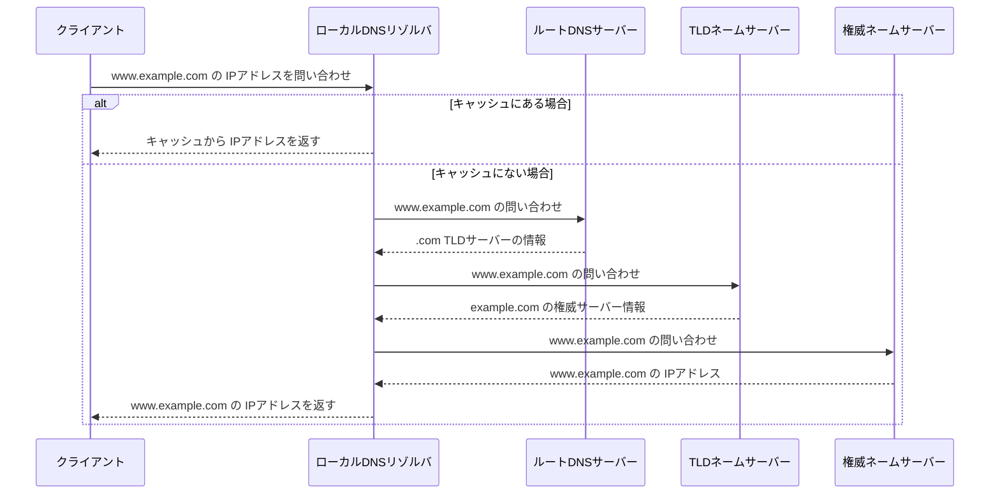
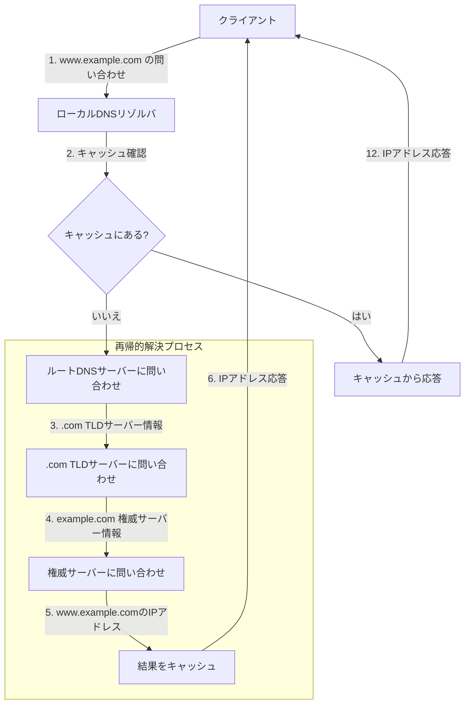
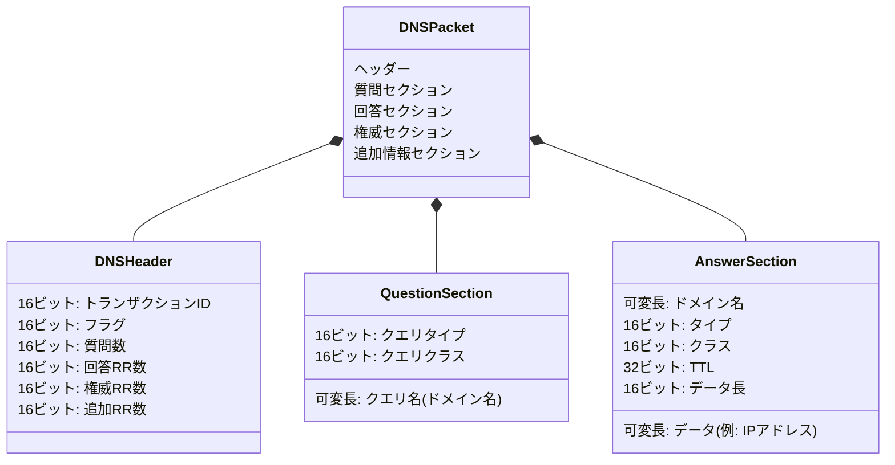
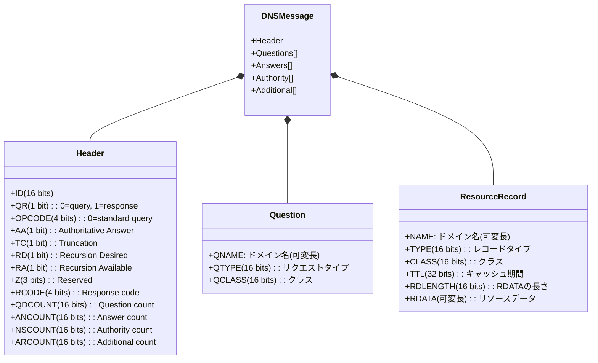
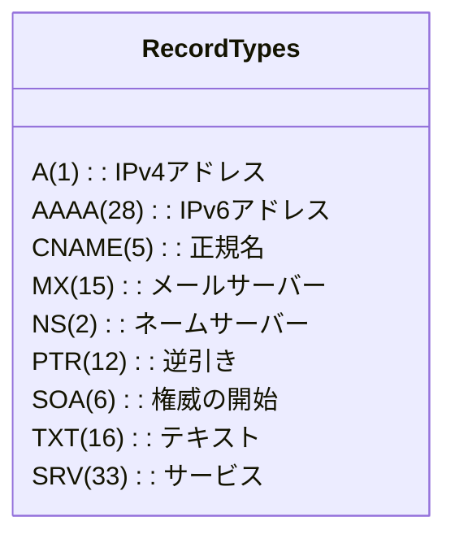
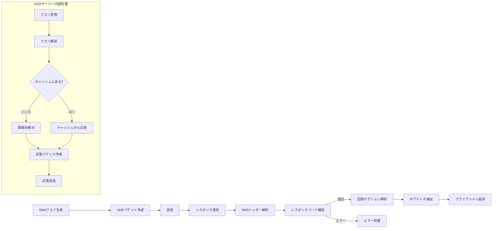

# DNS Flow and Packet Structure

This document describes the general flow of DNS resolution and the structure of DNS packets.

## DNS Resolution Flow

## DNS Recursive Resolution Process

## DNS Packet Structure

## DNS Message Format (Binary)

## DNS Record Types

## DNS Query and Response Processing

