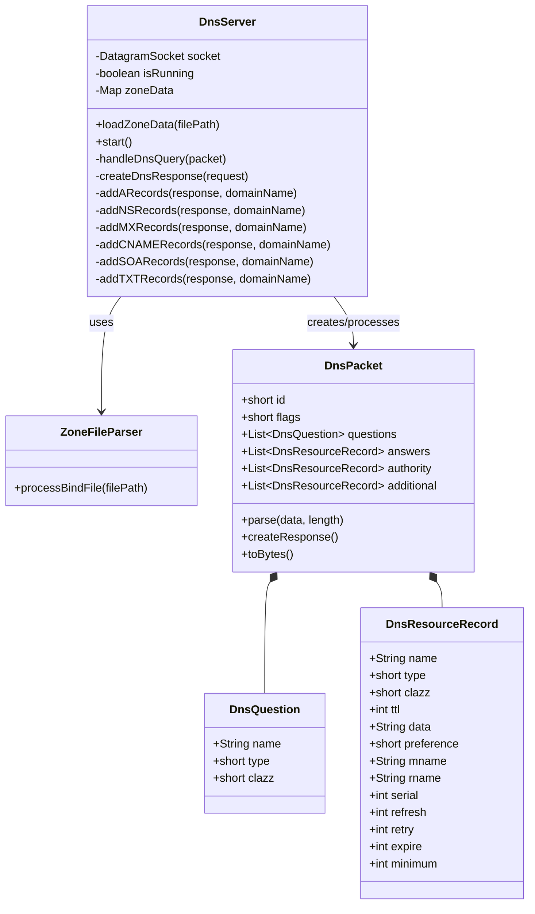
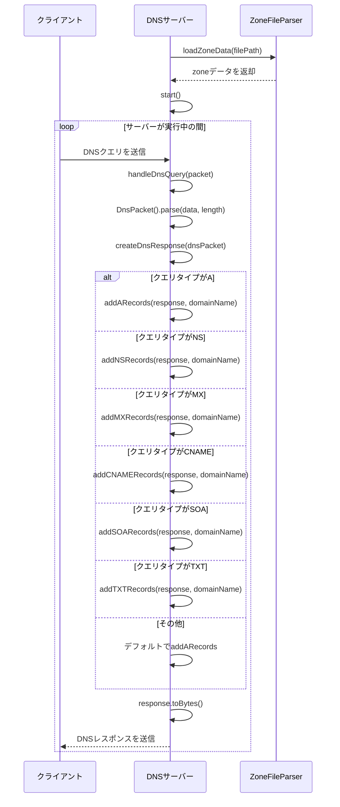
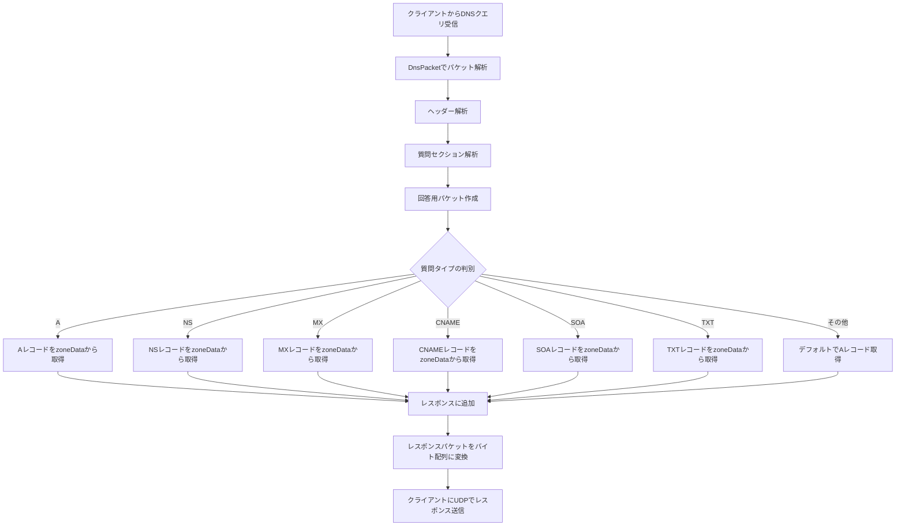
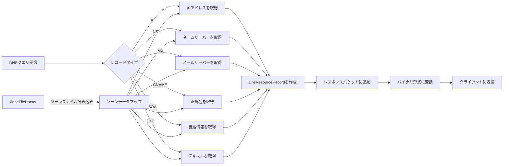
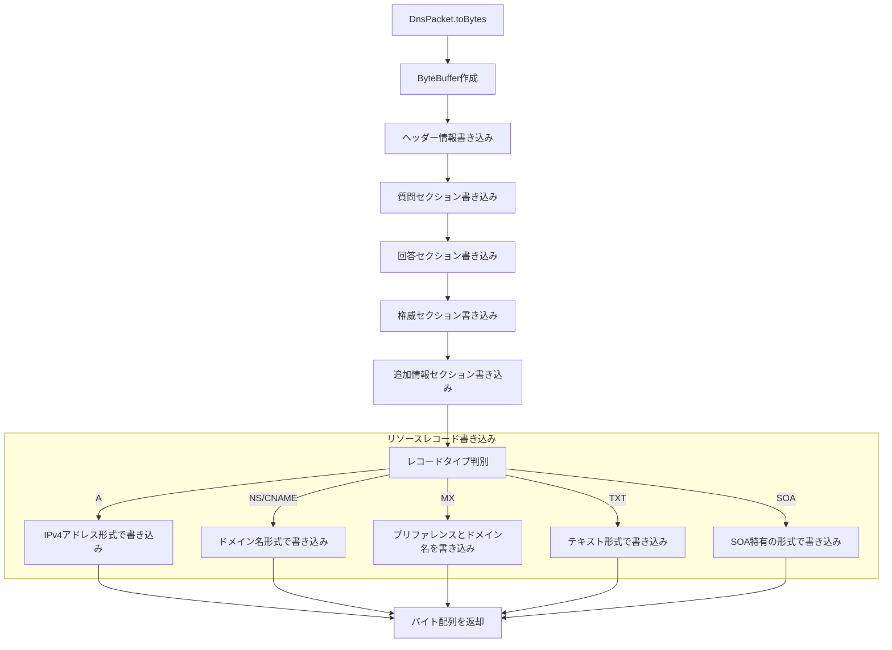

# Toy DNSサーバーの実装フロー

このドキュメントはToy DNSサーバーの実装固有のフローを説明します。

## DNSサーバーの基本構造

```mermaid
classDiagram
    class DnsServer {
        -DatagramSocket socket
        -boolean isRunning
        -Map zoneData
        +loadZoneData(filePath)
        +start()
        -handleDnsQuery(packet)
        -createDnsResponse(request)
        -addARecords(response, domainName)
        -addNSRecords(response, domainName)
        -addMXRecords(response, domainName)
        -addCNAMERecords(response, domainName)
        -addSOARecords(response, domainName)
        -addTXTRecords(response, domainName)
    }

    class ZoneFileParser {
        +processBindFile(filePath)
    }

    class DnsPacket {
        +short id
        +short flags
        +List~DnsQuestion~ questions
        +List~DnsResourceRecord~ answers
        +List~DnsResourceRecord~ authority
        +List~DnsResourceRecord~ additional
        +parse(data, length)
        +createResponse()
        +toBytes()
    }

    class DnsQuestion {
        +String name
        +short type
        +short clazz
    }

    class DnsResourceRecord {
        +String name
        +short type
        +short clazz
        +int ttl
        +String data
        +short preference
        +String mname
        +String rname
        +int serial
        +int refresh
        +int retry
        +int expire
        +int minimum
    }

    DnsServer --> ZoneFileParser: uses
    DnsServer --> DnsPacket: creates/processes
    DnsPacket *-- DnsQuestion
    DnsPacket *-- DnsResourceRecord
```

## DNSサーバーの実行フロー

```mermaid
sequenceDiagram
    participant Client as クライアント
    participant DnsServer as DNSサーバー
    participant ZoneParser as ZoneFileParser

    DnsServer->>ZoneParser: loadZoneData(filePath)
    ZoneParser-->>DnsServer: zoneデータを返却
    DnsServer->>DnsServer: start()

    loop サーバーが実行中の間
        Client->>DnsServer: DNSクエリを送信
        DnsServer->>DnsServer: handleDnsQuery(packet)
        DnsServer->>DnsServer: DnsPacket().parse(data, length)
        DnsServer->>DnsServer: createDnsResponse(dnsPacket)

        alt クエリタイプがA
            DnsServer->>DnsServer: addARecords(response, domainName)
        else クエリタイプがNS
            DnsServer->>DnsServer: addNSRecords(response, domainName)
        else クエリタイプがMX
            DnsServer->>DnsServer: addMXRecords(response, domainName)
        else クエリタイプがCNAME
            DnsServer->>DnsServer: addCNAMERecords(response, domainName)
        else クエリタイプがSOA
            DnsServer->>DnsServer: addSOARecords(response, domainName)
        else クエリタイプがTXT
            DnsServer->>DnsServer: addTXTRecords(response, domainName)
        else その他
            DnsServer->>DnsServer: デフォルトでaddARecords
        end

        DnsServer->>DnsServer: response.toBytes()
        DnsServer-->>Client: DNSレスポンスを送信
    end
```

## DNSパケット処理フロー

```mermaid
flowchart TD
    A[クライアントからDNSクエリ受信] --> B[DnsPacketでパケット解析]
    B --> C[ヘッダー解析]
    C --> D[質問セクション解析]
    D --> E[回答用パケット作成]

    E --> F{質問タイプの判別}
    F -->|A| G[AレコードをzoneDataから取得]
    F -->|NS| H[NSレコードをzoneDataから取得]
    F -->|MX| I[MXレコードをzoneDataから取得]
    F -->|CNAME| J[CNAMEレコードをzoneDataから取得]
    F -->|SOA| K[SOAレコードをzoneDataから取得]
    F -->|TXT| L[TXTレコードをzoneDataから取得]
    F -->|その他| M[デフォルトでAレコード取得]

    G --> N[レスポンスに追加]
    H --> N
    I --> N
    J --> N
    K --> N
    L --> N
    M --> N

    N --> O[レスポンスパケットをバイト配列に変換]
    O --> P[クライアントにUDPでレスポンス送信]
```

## このDNSサーバーのレコード処理フロー

```mermaid
flowchart LR
    A[ZoneFileParser] -->|ゾーンファイル読み込み| B[ゾーンデータマップ]

    C[DNSクエリ受信] --> D{レコードタイプ}
    D -->|A| E[IPアドレスを取得]
    D -->|NS| F[ネームサーバーを取得]
    D -->|MX| G[メールサーバーを取得]
    D -->|CNAME| H[正規名を取得]
    D -->|SOA| I[権威情報を取得]
    D -->|TXT| J[テキストを取得]

    B --> E
    B --> F
    B --> G
    B --> H
    B --> I
    B --> J

    E --> K[DnsResourceRecordを作成]
    F --> K
    G --> K
    H --> K
    I --> K
    J --> K

    K --> L[レスポンスパケットに追加]
    L --> M[バイナリ形式に変換]
    M --> N[クライアントに返送]
```

## DNSパケットのシリアライズ処理

```mermaid
flowchart TD
    A[DnsPacket.toBytes] --> B[ByteBuffer作成]
    B --> C[ヘッダー情報書き込み]
    C --> D[質問セクション書き込み]
    D --> E[回答セクション書き込み]
    E --> F[権威セクション書き込み]
    F --> G[追加情報セクション書き込み]

    subgraph "リソースレコード書き込み"
        H[レコードタイプ判別] -->|A| I[IPv4アドレス形式で書き込み]
        H -->|NS/CNAME| J[ドメイン名形式で書き込み]
        H -->|MX| K[プリファレンスとドメイン名を書き込み]
        H -->|TXT| L[テキスト形式で書き込み]
        H -->|SOA| M[SOA特有の形式で書き込み]
    end

    G --> H
    I --> N[バイト配列を返却]
    J --> N
    K --> N
    L --> N
    M --> N
```